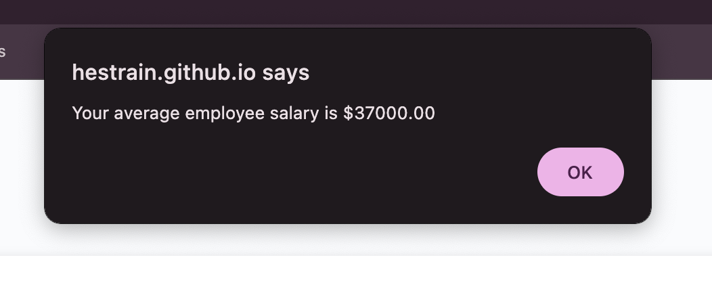
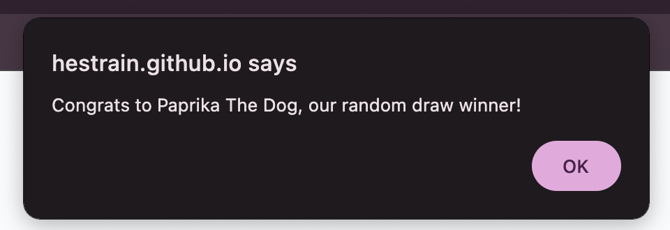

# Module 3 - Javascript - Employee-Payroll-Page

## Description
This is the Javascript Challenge. Making an employee payroll page using Javascript. The challenge was to be able to use window prompts to enter information that would be stored as variables/objects/arrays, and then be able to use that information to get an average salary. We also got to use the math random ability!

Below are screenshots to see the final product: 

## Installation

N/A

## Usage
This website can be used to view my bio, 5 pieces of work, and some contact information. This can be used in the future for potential employers or co-workers. 

For now, not all of the "Work" items are coding related, but by the end of the course I'm sure they will be. 

The live webpage can be found hosted on github at the following link: hestrain.github.io/June-Portfolio/ 

The code repository can be found on github at the following link: https://github.com/hestrain/June-Portfolio

## Credits

Me I guess!

## License
MIT License

Copyright (c) 2024 Heather Strain

Permission is hereby granted, free of charge, to any person obtaining a copy
of this software and associated documentation files (the "Software"), to deal
in the Software without restriction, including without limitation the rights
to use, copy, modify, merge, publish, distribute, sublicense, and/or sell
copies of the Software, and to permit persons to whom the Software is
furnished to do so, subject to the following conditions:

The above copyright notice and this permission notice shall be included in all
copies or substantial portions of the Software.

THE SOFTWARE IS PROVIDED "AS IS", WITHOUT WARRANTY OF ANY KIND, EXPRESS OR
IMPLIED, INCLUDING BUT NOT LIMITED TO THE WARRANTIES OF MERCHANTABILITY,
FITNESS FOR A PARTICULAR PURPOSE AND NONINFRINGEMENT. IN NO EVENT SHALL THE
AUTHORS OR COPYRIGHT HOLDERS BE LIABLE FOR ANY CLAIM, DAMAGES OR OTHER
LIABILITY, WHETHER IN AN ACTION OF CONTRACT, TORT OR OTHERWISE, ARISING FROM,
OUT OF OR IN CONNECTION WITH THE SOFTWARE OR THE USE OR OTHER DEALINGS IN THE
SOFTWARE.

## Badges
N/A

## Features
You able able to enter as many employees as you want. 
After the Popups/Alerts close you will be able to see all the employees and their salaries on a table.
The average salary is calculated. 
A random employee is selected.

## How to Contribute

N/A

## Tests

N/A